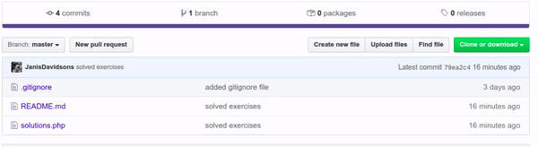

This project contains file called solutions.php, which
solves three exercises. It consists of three parts - two functions
and one class.  

    Firs copy project adress like this:

    Then open terminal within a folder, were you want to download file.
Enter command "git clone" and paste adress you copied above in terminal.

    And now type php solution.php

This exercise shows:
 
          * how to find first od even pair in array.
          * how to find sum of number in array from index a to index b.
          * how to extract part of string from first character occurrence to second char occurrence.
          
If I had more time, I would implement a way, to let user enter search parameters for each function.
